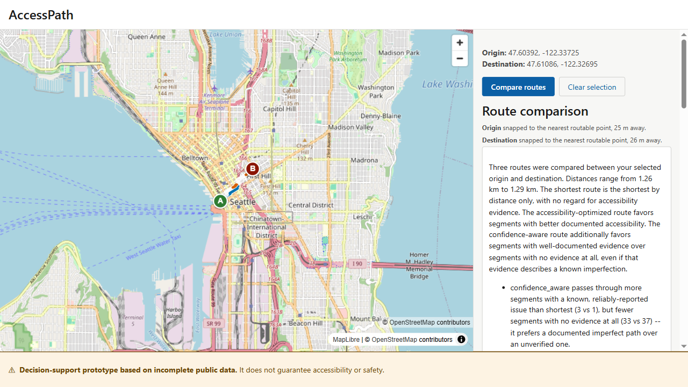

<h1 align="center">AccessPath</h1>
<p align="center"><em>Confidence-aware accessible pedestrian routing for Seattle — a research prototype.</em></p>

> **This is a decision-support research prototype built on incomplete, crowdsourced public data. It does not guarantee accessibility or safety, and its relative scores are not probabilities of any real-world outcome.** See [Limitations](#known-limitations) and [Ethical considerations](#ethical-considerations) before drawing any conclusion from it.


*A real, live comparison: three routes rendered on the map (solid = shortest, dashed = accessible, dotted = confidence-aware), with a deterministic, plain-language explanation of the trade-off on the right — not just a score.*

## What this is

AccessPath compares three walking routes between two points in Seattle side by side:

- **Shortest** — pure distance, no accessibility data used.
- **Accessible** — favors segments with better documented accessibility, regardless of how much evidence backs that assessment.
- **Confidence-aware** — additionally favors segments with well-documented evidence (even evidence describing a real, known imperfection) over segments with no evidence at all, because "no evidence" is not the same as "no problem."

The point of the three-way comparison isn't to declare one route "correct" — it's to make the *trade-off* between distance, documented accessibility, and evidence confidence visible and inspectable, instead of collapsing it into a single hidden score.

## Who this is for

Built as a portfolio/research project, not a shipped product. The target user is someone evaluating whether *confidence-aware* routing (as opposed to routing that treats "no data" and "good data" the same way) is a workable idea for real accessibility-routing tools — a mobility researcher, an accessibility-tooling team, or a reviewer of this project's engineering.

## What makes this different from typical routing demos

- It treats **absence of evidence as a distinct state**, not a neutral or a bad one — an unmatched, unlabeled segment is `unknown`, never silently averaged in as "probably fine."
- Its scoring model explicitly **cannot be argued out of a real hazard** by volume of positive evidence — one reliable severe report imposes a ceiling that ten unrelated positive labels cannot lift (a deliberate fix after an earlier weighted-average model was shown, adversarially, to allow exactly that — see [Evaluation methodology and results](#evaluation-methodology-and-results)).
- Every routing decision comes with a **deterministic, plain-language explanation** — same route, same explanation, every time — not a black-box score.
- Disconnected-network edge cases (routing between two points with no path between them, or snapping across a gap in the network) are **surfaced explicitly to the user**, not hidden behind a generic error or a silently-wrong path.

## Architecture

See [`docs/architecture.md`](docs/architecture.md) for the full diagram and a walkthrough of exactly where uncertainty, ambiguous matches, unmatched labels, disconnected graph components, and deterministic explanations enter the system. In short: OSM + Project Sidewalk → offline ingestion/matching scripts → PostGIS → a scoring pipeline → an in-process cached NetworkX graph → A* routing (3 modes) → FastAPI → the React/MapLibre frontend.

## Data pipeline

| Stage | Script | What it does |
|---|---|---|
| 1 | `build_graph.py` | OSM pedestrian ways/nodes (footway, path, pedestrian, steps, crossings, kerbs) → a routable node/segment graph. 184,695 nodes, 213,508 edges. |
| 2 | `validate_matching.py` | Compares label-to-segment matching thresholds (5/10/15/30m); production uses **10m**. |
| 3 | `analyze_connectivity.py` | Connected-component analysis: 2,696 components, largest holds 82.2% of nodes. |
| 4 | `backfill_label_provenance.py` | Backfills pano/source metadata used by the non-independence (duplicate-report) confidence discount. |
| 5 | `compare_scoring_models.py` | Regenerates the scoring-model comparison report (must run before step 6, which appends to the same file). |
| 6 | `compute_scores.py` | Computes `accessibility_score`/`confidence_score` for all 214,056 segments using the production model. |

262,053 Project Sidewalk labels are joined to segments at a 10m threshold (198,869–227,052 matched depending on threshold tested; 10m chosen as the best trade-off — see [`docs/week2_graph_report.md`](docs/week2_graph_report.md)). 90,423 segments (42.2%) end up with at least one matched label; the remaining 57.8% are `unknown`.

## Accessibility & confidence model

Production model: **ceiling-capped risk accumulation** (`backend/app/core/scoring.py`), the result of a Week 3.5 review that rejected a simpler weighted-average model after adversarial testing showed it could be out-voted — e.g. ten `CurbRamp` labels pulling a segment with one reliable `NoSidewalk` report up to a score of 0.62, when it should read as clearly inaccessible. The production model instead computes `final_score = min(risk_accumulation_score, dominance_ceiling)`, where the ceiling is derived **only** from reliable hazard labels — no amount of positive evidence can raise it. On the same adversarial case, the production model scores 0.05.

Confidence is computed separately from the accessibility score itself, combining:
- **Agreement** between labels (contested evidence lowers confidence, even if the average score looks moderate)
- **Recency** (older labels count for less)
- **Match quality** (how far the label sat from the segment it was joined to)
- **Ambiguity** (label sat between two genuinely different OSM ways — flagged for 8.2% of labels)
- **Cross-domain discount** (evidence about a crossing being partially applied to the adjoining footway, or vice versa)
- **Non-independence discount** (multiple labels from the same Street View pano don't count as independent confirmations)

Production defaults — `RELIABILITY_DOMINANCE_CUTOFF = 0.3`, `CROSS_DOMAIN_DISCOUNT = 0.15` — were chosen after a 3×3 sensitivity sweep (cutoffs 0.2/0.3/0.4 × discounts 0.0/0.15/0.3) and manual inspection of real segments at each setting; see [`docs/week3_5_scoring_review.md`](docs/week3_5_scoring_review.md) for the full comparison and the audit confirming `CROSS_DOMAIN_DISCOUNT` does propagate into confidence (it does; `RELIABILITY_DOMINANCE_CUTOFF` deliberately does not, since it only gates the accessibility ceiling).

On the full dataset: mean accessibility 0.511 (p50 0.515), mean confidence 0.140 (p50 0.087) — confidence is low across the board, which is an honest reflection of how sparse real crowdsourced coverage is, not a bug.

## Routing modes

All three modes run A* over the identical graph; they differ only in `edge_weight = length_m * multiplier`, with `multiplier >= 1` for every mode (so true path cost is always ≥ straight-line distance — the admissibility argument that makes A* provably still optimal for all three, not just `shortest`; see [`docs/week7_hardening_report.md`](docs/week7_hardening_report.md)). A route request between two disconnected graph components returns a `no_connected_route` result (HTTP 200 — a well-defined outcome, not a server error), and coordinate snapping prefers a same-connected-component point over the absolute-nearest one when they differ, disclosing that trade-off in the response.

## API

`backend/app/main.py`, FastAPI, port 8000:

- `POST /route/compare` — the three-mode comparison. Request: `origin_lat/lon`, `destination_lat/lon`. Response includes each mode's geometry, distance, accessibility/confidence scores (mean + min), hazard list, unknown/low-confidence/disputed segment ids, a deterministic explanation, and a `disclaimer` field repeated in every response.
- `GET /segments?bbox=...`, `GET /labels?bbox=...`, `GET /coverage-summary?bbox=...` — bounded (~3.3km × 3.3km max) map data for the coverage view, capped at 2,000 results with `truncated`/`count` fields.
- `GET /segments/{id}` — single-segment geometry lookup (used by the frontend's "focus on map" feature).
- `GET /health`, `GET /health/graph` — liveness and routing-graph load stats.

Errors use one consistent envelope shape; validation errors return 422, out-of-service-area/no-routable-network return 400, `no_connected_route` returns 200 (it's a valid answer), and unhandled exceptions return a fixed generic 500 body with the real exception logged server-side only — confirmed by a test that a fake Postgres-credential-shaped exception message never reaches the client.

## Frontend

React + TypeScript + Vite + MapLibre GL JS, no API key required (free OSM basemap). The three modes are visually distinguished with a colorblind-safe (Okabe-Ito) palette *and* line style, never color alone: `shortest` is solid black, `accessible` is dashed blue, `confidence_aware` is dotted vermillion. Non-route symbols (hazard, unknown-coverage, disputed-evidence) are distinguished by shape as well as color for the same reason.

The interface implements 11 explicit states (initial, origin selected, both selected, loading, success, no-connected-route, outside-service-area, no-nearby-network, API-unavailable-with-retry, empty-hazard-list, identical/partial results) — see [`docs/week6_frontend_report.md`](docs/week6_frontend_report.md) for the exact copy and behavior of each. Accessibility: WCAG AA contrast throughout, real semantic landmarks and buttons (not div soup), a 3px focus outline never suppressed, `prefers-reduced-motion` respected, `jest-axe` reporting 0 violations, and manual keyboard/200%-zoom verification.

Two real bugs were found and fixed during Week 6's live browser testing: a whole-page-scroll layout bug (fixed with `min-height: 0` on the sidebar plus `overflow: hidden` on the root), and Vite's dev server not detecting file changes through a Docker volume mount on Windows (fixed with `usePolling: true`).

## Evaluation methodology and results

A frozen 8-pair benchmark (`docs/week7_benchmark_pairs.json`, one pair per structural category — short/medium/long/well-labeled/heavy-unknown/cross-component/modes-agree/modes-diverge, each pair's selection method documented and empirically qualified against the real graph) was locked **before** any of the results below were seen, per this project's own evaluation discipline. The full run (`docs/week8_evaluation_report.md`, raw data in `docs/week8_evaluation_results.json`) found:

- **71.4%** of connected pairs showed at least one mode choosing a different route than `shortest`.
- `confidence_aware` **reduced unknown-segment exposure in every pair with a real choice** (mean 54.2% → 49.6% across the sample), most sharply on longer routes (53.9% → 36.2% on the 14km pair) — at a typical cost of a couple of percent added distance (median +2.78%).
- That reduction is **not free**: in 3 of 5 divergent pairs, `confidence_aware` *increased* low-confidence-segment exposure while decreasing unknown-segment exposure — it shifts exposure from "no evidence" toward "known but uncertain evidence," not toward "certainty," and the report says so explicitly rather than only reporting the metric that looks good.
- The most dramatic-looking number in the raw data (a "10.6% detour") is **5 meters** on a 49-meter route — reported everywhere alongside its absolute value specifically so a percentage alone can't misrepresent it.

**This evaluation is a curated demonstration on 8 hand-picked pairs, not a statistical claim about Seattle-wide routing behavior.** Read the full report for the complete honest interpretation, including the geometry-validation due-diligence process (large coordinate jumps were investigated and confirmed to be benign sparse-OSM-vertex artifacts, not stitching bugs, by cross-referencing raw segment/node coordinates directly in the database) and the reasoning behind the primary/fallback demo pair selection.

## Performance

The `long`-category route (14km) dropped from 4.7s to 1.9s full-HTTP median latency after switching Dijkstra → A* with an admissible haversine heuristic (2.5–3.3x speedup on long/diverging routes, zero measurable regression on short ones); every path returned before and after the change is bit-identical, not just equally optimal. See [`docs/week7_hardening_report.md`](docs/week7_hardening_report.md) for the full before/after table, the correctness argument, and the options considered and rejected (bidirectional Dijkstra, response caching).

## Tech stack

- **Data**: OpenStreetMap (ODbL, via Overpass), Project Sidewalk (CC0 1.0)
- **Database**: PostGIS 16 / Postgres
- **Backend**: Python, FastAPI, NetworkX, psycopg2
- **Frontend**: React, TypeScript, Vite, MapLibre GL JS
- **Testing**: pytest (backend), Vitest + Testing Library + jest-axe (frontend unit/a11y), Playwright (e2e)
- **Orchestration**: Docker Compose (3 services: `db`, `api`, `frontend`)

## Local setup

```bash
docker compose up
```

- API: `http://localhost:8000` (health check at `/health`)
- Frontend: `http://localhost:5173`

### Rebuilding the graph and scores from raw data

Run in this exact order (each script depends on state the previous one wrote):

```bash
docker compose exec api python scripts/build_graph.py
docker compose exec api python scripts/validate_matching.py
docker compose exec api python scripts/analyze_connectivity.py
docker compose exec api python scripts/backfill_label_provenance.py
docker compose exec api python scripts/compare_scoring_models.py
docker compose exec api python scripts/compute_scores.py
```

### Tests

```bash
# Backend (91 tests: data-quality-against-live-DB + pure-function scoring/routing/API unit tests)
docker compose exec api pytest tests/ -v

# Frontend (26 tests: components, API client, accessibility)
cd frontend && npm install && npm test

# End-to-end (run from the HOST against the running compose stack -- NOT
# from inside the frontend container, which can't reach the api container
# via localhost)
cd frontend
npx playwright install chromium   # once
npm run e2e
```

### Reproducing the frozen evaluation

```bash
docker compose exec api python scripts/run_evaluation.py         # writes docs/week8_evaluation_results.json
docker compose exec api python scripts/validate_route_geometry.py # writes docs/week8_geometry_validation.json
```

Both scripts read `docs/week7_benchmark_pairs.json` read-only — they never regenerate or reselect the frozen pairs.

## Data acquisition

Raw source files (`data/raw/*.json`, ~370MB total — **excluded from version control via `.gitignore`**, see [Reproducibility](#reproducibility)) come from:
- **OSM**: an Overpass query for `highway=footway|path|pedestrian|steps`, `footway=crossing`, and `kerb=*`/`highway=crossing` nodes, bounded to Seattle's official admin boundary (OSM relation 237385). See [`docs/data_verification.md`](docs/data_verification.md) for the exact query and element counts.
- **Project Sidewalk**: a full raw-labels export from `sidewalk-sea.cs.washington.edu`'s public API, no bbox filter.

## Data licenses & attribution

- **OpenStreetMap** data is © OpenStreetMap contributors, licensed [ODbL](https://opendatacommons.org/licenses/odbl/) — attribution is shown in the frontend's map attribution control (required, not optional).
- **Project Sidewalk** label metadata (coordinates, type, severity, validation counts) is [CC0 1.0](https://creativecommons.org/publicdomain/zero/1.0/) — no restriction. Labels are volunteer annotations of Google Street View panoramas; **this project does not fetch, store, or display any Street View imagery**, only Project Sidewalk's own derived label data, which avoids Google's imagery-redistribution restrictions entirely.

## Reproducibility

A new developer can: clone the repo, run `docker compose up` (starts empty schema + API + frontend), separately obtain the three raw JSON files above and place them under `data/raw/` (excluded from the repo — see below), run the 6-step pipeline above to populate and score the database, then run the test suites and the frozen evaluation exactly as shown above. Nothing in the pipeline or tests depends on state that isn't either in this repo or reproducibly derived from the two public data sources.

**Excluded from version control** (`.gitignore`): `data/raw/` (the ~370MB raw datasets), `__pycache__/`, `.venv/`/`venv/`, `node_modules/`, `.env`, `*.egg-info/`, `.pytest_cache/`, `frontend/dist/`, `frontend/tsconfig.tsbuildinfo`, Playwright's `test-results/`/`playwright-report/`, coverage output, and common editor/OS files (`.vscode/`, `.idea/`, `.DS_Store`, `Thumbs.db`). There is no database volume, generated cache file, or credential file tracked anywhere in the repo — the routing graph is rebuilt in-memory at API startup from the database every time, never serialized to disk. The `docker-compose.yml` Postgres password (`accesspath_dev_only`) is an explicitly-named local-only development credential, not a real secret.

## Deployment

**Not currently deployed anywhere.** The frontend is prepared for static hosting on **Vercel**; the backend and database are not part of this phase. Full detail in [`docs/deployment.md`](docs/deployment.md) — summary:

- **Vercel hosts only `frontend/`** as a static Vite build (project Root Directory set to `frontend`; build command `npm run build`, output `dist` — both are Vercel's own Vite-project defaults, no `vercel.json` needed).
- **FastAPI (`backend/`) requires its own separately deployed, persistent host** — not Vercel Functions. The API caches an in-memory routing graph (~370MB, ~2s to load) across requests, which a stateless serverless function can't do efficiently; migrating routing to a serverless model is out of scope for this phase.
- **PostGIS requires a managed external Postgres instance** with the PostGIS extension enabled — not part of this phase either.
- The frontend talks to the backend via the `VITE_API_BASE_URL` build-time environment variable (see [`.env.example`](frontend/.env.example)). If a production build is ever made **without** this set, the app now fails immediately with a clear "AccessPath is not configured" message instead of silently trying to reach `localhost:8000` in a visitor's browser.
- Once a backend is deployed, its `ALLOWED_ORIGINS` environment variable must include the final Vercel domain, or the deployed frontend's requests will be rejected by CORS (the backend fails closed, not open, by design).
- The offline data pipeline (OSM/Project Sidewalk ingestion, matching, scoring) is a one-time setup step against the target database, not something that runs on every API startup — see [`docs/deployment.md`](docs/deployment.md) for the production version of the same 6-step pipeline used locally.

## Known limitations

- **This is not a safety or compliance tool.** Scores are relative and derived from incomplete crowdsourced/OSM data, not calibrated probabilities or an accessibility guarantee.
- **8-pair evaluation is a demonstration, not a statistical sample** of Seattle-wide behavior — see [Evaluation methodology and results](#evaluation-methodology-and-results).
- **Confidence-aware routing is not a strict improvement on every uncertainty metric simultaneously** — it can increase low-confidence-segment exposure while decreasing unknown-segment exposure (documented, not hidden, in the evaluation report).
- **17.8% of graph nodes sit in a component other than the main one** (mostly digitization/snapping artifacts per Week 2's investigation, not real physical gaps) — routing across these fails closed with an explicit message rather than silently.
- **`medium`-length routes' HTTP latency barely benefited from the A* optimization** (355ms → 336ms) because fixed per-request overhead (DB connection, geometry serialization) dominates at that scale.
- **No authentication, rate limiting, or offline support** — appropriate for a local research prototype, not for public deployment as-is.
- **`ASSUMED_WALKING_SPEED_MPS = 1.2`** is an uncalibrated placeholder used only for the estimated-time display, not validated against real pedestrian speeds (including varying accessibility needs).
- **Frontend production bundle is ~972KB** (mostly MapLibre GL), unaddressed — out of scope for this project's stated goals.

## Ethical considerations

- Real crowdsourced accessibility data reflects **who reported what, where, and when** — sparse coverage in a neighborhood means "no data," not "no problems." Treating unknown segments as neutral (rather than "probably fine") is a direct design response to this, but it doesn't eliminate the underlying data gap.
- The dominance-ceiling model was specifically built so that **volume of positive reports cannot outvote one reliable severe report** — a deliberate ethical stance that "many people said it's fine" should not be allowed to override "one reliable report says otherwise" for a hazard that could meaningfully harm someone.
- All scores are presented with an explicit disclaimer on every single API response and throughout the frontend, precisely so a relative accessibility score is never mistaken for a certified accessibility rating.
- This project makes no claim to represent people with any specific disability's actual experience — Project Sidewalk's label taxonomy (curb ramps, obstacles, surface problems, etc.) is itself a simplification of real mobility needs.

## Project scope and rejected features

Explicitly out of scope for this project (not oversights — considered and deliberately excluded): slope/grade data, computer-vision analysis of Street View imagery, Mapillary integration, user accounts/authentication, migrating the backend to a serverless/Vercel-Functions architecture (see [Deployment](#deployment)), and any feature added purely for visual polish without a stated accessibility-routing purpose. Caching of route-comparison responses was also considered and rejected (Week 7) as adding staleness-management complexity disproportionate to a one-off local prototype's actual bottleneck.

## Future work

- Calibrate `ASSUMED_WALKING_SPEED_MPS` against real pedestrian-speed data, ideally segmented by mobility-aid type.
- Investigate node-snapping to reduce the 17.8%-of-nodes minor-component fragmentation identified in Week 2.
- Expand the evaluation set beyond 8 pairs if a claim broader than "demonstrated on these examples" is ever needed.
- Profile and address `medium`-route fixed-overhead latency if that route length becomes the primary use case.
- Code-split the frontend bundle (MapLibre GL is the majority of its ~972KB) if initial load time becomes a priority.

---

For the full week-by-week engineering history (each week's report, review, and hardening pass), see the `docs/` directory — in particular [`week2_graph_report.md`](docs/week2_graph_report.md), [`week3_5_scoring_review.md`](docs/week3_5_scoring_review.md), [`week4_routing_report.md`](docs/week4_routing_report.md), [`week5_api_report.md`](docs/week5_api_report.md), [`week6_frontend_report.md`](docs/week6_frontend_report.md) / [`week6_visual_system.md`](docs/week6_visual_system.md), [`week7_hardening_report.md`](docs/week7_hardening_report.md), and [`week8_evaluation_report.md`](docs/week8_evaluation_report.md).
