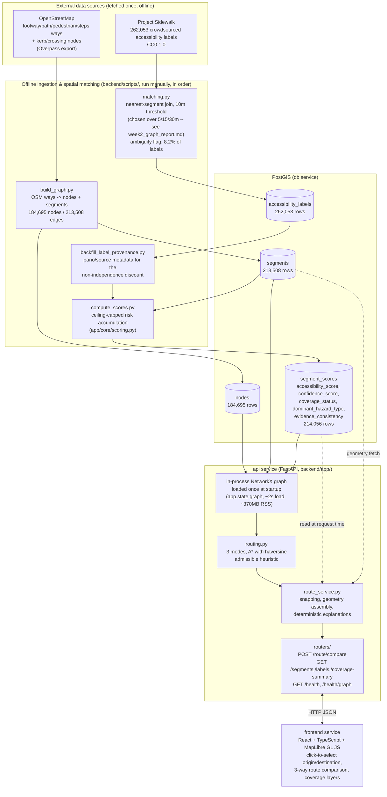

# Architecture

AccessPath is a single-region (Seattle) prototype built as three Docker Compose services: a PostGIS database, a FastAPI backend that owns both the offline data pipeline and the online routing API, and a React/MapLibre frontend. There is no separate "ingestion service" — the pipeline is a sequence of one-shot scripts run against the same database the API reads from.

## System diagram

## Where uncertainty and ambiguity enter the system

This is the part most likely to be asked about in review, so it's called out explicitly rather than left implicit in the diagram:

1. **Unmatched labels** — a Project Sidewalk label with no OSM segment within 10m is simply not joined to any segment (`matching.py`); it contributes to neither that segment's evidence nor any other. It is not silently dropped from the dataset, just from scoring, and the 10m threshold's trade-off (how many well-matchable label types are lost at each candidate threshold) is documented in `docs/week2_graph_report.md`.
2. **Ambiguous matches** — when a label sits equidistant-ish between two different OSM ways (not just two segments of the same way), it's flagged (`ambiguity` factor), which *lowers* that label's contribution to confidence rather than picking one segment arbitrarily and asserting certainty it doesn't have.
3. **Disconnected graph components** — 2,696 connected components exist in the raw node/segment graph; the largest holds 82.2% of all nodes. A route request between two different components fails closed with an explicit `no_connected_route` result (HTTP 200, not an error — it's a valid answer, not a system failure) rather than silently returning a nonsensical path. Coordinate snapping also prefers a node in the *same* component as the other endpoint over the absolute-nearest node, and discloses when it did so (`adjusted_for_connectivity`).
4. **Unknown segments** — a segment with zero matched labels gets `coverage_status: "unknown"`, a neutral accessibility score (0.5), and zero confidence. This is deliberately distinct from "known good" and is never merged with or averaged against segments that do have evidence.
5. **Deterministic explanations** — `route_service.build_mode_explanation()` and `build_comparison_notes()` contain no randomness and sort hazard types alphabetically, so the same route always produces the same explanation text; this keeps the system's stated reasoning inspectable and reproducible rather than a black box.
6. **The scoring ceiling itself** — the dominance rule (`app/core/scoring.py`) caps a segment's accessibility score based only on its most severe *reliable* hazard label, deliberately excluded from being raised back up by any number of positive labels. This is the single biggest place uncertainty is turned into an explicit, testable rule rather than an emergent property of an averaging formula (see `docs/week3_5_scoring_review.md` for the adversarial tests that justify it).

## Routing: three modes, one graph, one algorithm

All three modes (`shortest`, `accessible`, `confidence_aware`) run A* over the *same* NetworkX graph and the *same* `astar_path` call; they differ only in the edge-weight function (`routing.edge_weight`), which is always `length_m * multiplier` with `multiplier >= 1`. Because true path cost is therefore always at least the straight-line (haversine) distance, the haversine heuristic used for A* is provably admissible for every mode — a single correctness argument covers all three, rather than one per mode (full argument in `docs/week7_hardening_report.md` Section 2). `shortest` never explored per-mode caching or a second algorithm; the same code path is reused for all three, verified bit-identical against pre-optimization Dijkstra output for every frozen benchmark pair.

## Data pipeline order (why it's this order)

`build_graph.py` must run before `matching.py` (segments have to exist to join labels to). `matching.py` must run before `backfill_label_provenance.py` and `compute_scores.py` (scoring reads `segment_scores` rows keyed by matched labels). `compare_scoring_models.py` must run before `compute_scores.py` in the documented sequence only because it *regenerates* `docs/week3_scoring_report.md`'s comparison section, which `compute_scores.py` then appends its own distribution to — not a data dependency, a report-file ordering one. This ordering is enforced by convention in the README's run instructions, not by a workflow engine, since it's a one-time-per-database-rebuild pipeline, not a recurring job.
